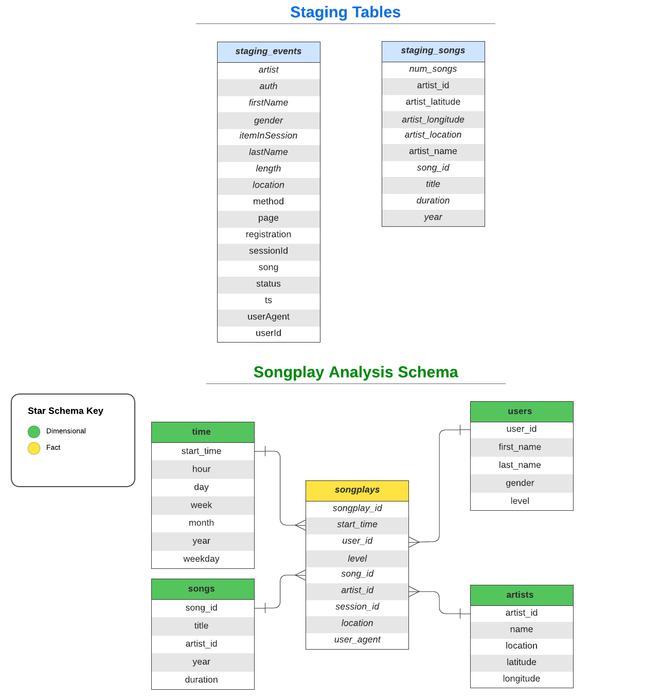

# Project: Data Warehouse - AWS Redshift

A music streaming startup, Sparkify, has grown their user base and song database and want to move their processes and data onto the cloud. Their data resides in S3, in a directory of JSON logs on user activity on the app, as well as a directory with JSON metadata on the songs in their app.

The main role is to build an ETL pipeline that extracts their data from S3, stages them in Redshift, and transforms data into a set of dimensional tables as a data warehouse for their analytics team to continue finding insights into what songs their users are listening to.

## Database Schema Design

### This project uses the star schema as follows:

### Creating Sparkify Database and Tables

- Write `CREATE` and `DROP` statements in `sql_queries.py` to create each table and to drop each table if it exists.
- Run `create_tables.py` to create your fact and dimension tables for the star schema in Redshift..

## Database ETL Pipeline

- The data extracted from the JSON song files in`s3://udacity-dend/song_data` populate the **staging_songs** table 
- The data extracted from the JSON log files in`s3://udacity-dend/log_data` populate the **staging_events** table
- A `COPY` command loads the data from resources in s3 bucket into the staging tables
- A `SELECT` query extracts corresponding records **staging_songs** and **staging_events** tables to populate the analytics tables.
- Use `launch_cluster.ipynb` to launch a Redshift cluster and create an IAM role that has read access to S3.
- Add redshift database and IAM role info to `dwh.cfg`.
- Run `etl.py` to process the entire datasets and load data from S3 into staging tables on Redshift and then process that data into your analytics tables on Redshift.
- Remember to run `create_tables.py` before running `etl.py` to reset your tables
- Run `test.py` to confirm your records were successfully inserted into each table.

